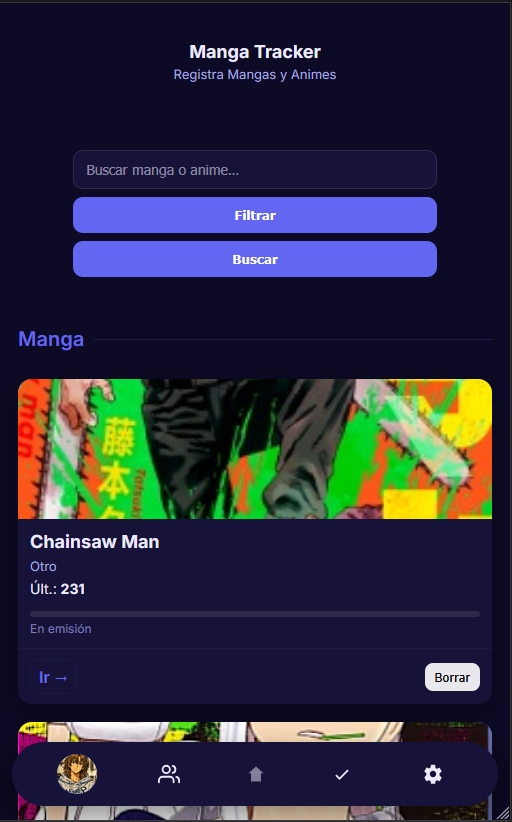
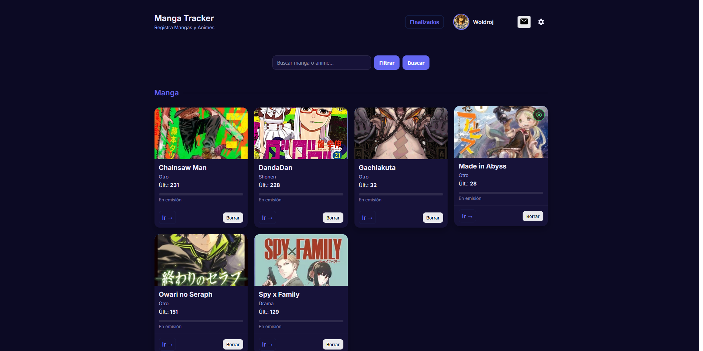

# 📚 MangaTracker

---

**MangaTracker** is a modern web application (PWA) designed to manage your manga reading and anime viewing quickly, easily, and elegantly. Forget about complicated lists; keep your progress up to date with a mobile-optimized interface and instant synchronization.

[🚀 Open MangaTracker](https://woldroj.github.io/Manga-Tracker/)

---

## ✨ Key Features

* **⚡ Instant Loading:** Designed to be lightweight and fast, even on slow connections.
* **☁️ Cloud Sync:** Thanks to Firebase integration, your data follows you on any device when you log in.
* **📱 Native App Experience (PWA):** Add it to your home screen and use it just like an installed application.
* **🔍 Chapter Detection:** Smart system to help you identify new available content.
* **🌓 Visual Modes:** Full support for dark and light modes to suit your preferences.
* **📂 Efficient Organization:** Categorize your series by status: *Reading* or *Completed*.

---

## 🎓 Interactive Onboarding (Tutorial)

To ensure a smooth start for every user, MangaTracker includes a built-in **Interactive Tutorial** that triggers upon the first verified login. Key functions include:

* **Step-by-Step Guidance:** Highlights essential UI elements like the "Add" button, search bar, and user settings.
* **Visual Overlays:** Dims the background to focus the user's attention on specific features.
* **Progress Tracking:** Saves completion status to the cloud so you only see it once.
* **Contextual Help:** Explains how to sync with external sources and manage your library effectively.

---

## 📸 Preview & Interface

The application is built with a **Mobile-First** approach, ensuring that managing your manga is comfortable from anywhere with just one hand.

| Mobile View | Desktop View |
| :---: | :---: |
|  |  |

---

## 🛠️ Built With

* **Architecture:** HTML5, CSS3 (Modern variables, Grid/Flexbox), and Vanilla JavaScript (ES6+).
* **Backend:** [Firebase](https://firebase.google.com/) (Authentication and Firestore real-time database).
* **PWA:** Service Workers and Web App Manifest for a fluid mobile experience.
* **Design:** Inter typography for superior readability and a minimalist aesthetic.

## 📱 How to Use the App

1.  **Access:** Go to the official URL and sign up.
2.  **Verification:** Check your email to verify your account and unlock all features.
3.  **Tutorial:** Follow the interactive guide to learn the basics.
4.  **Add Content:** Register your favorite manga or anime and update your progress.
5.  **Installation:** On your mobile device, select "Add to Home Screen" from your browser.

---

## 🤝 Contributing

If you are a developer and want to propose aesthetic or functional improvements:

1.  **Fork** the project.
2.  Create a branch for your improvement: `git checkout -b feature/NewImprovement`.
3.  **Push** your changes and open a **Pull Request**.

## 📄 License

This project is distributed under the **MIT License**.

---
Developed with passion by [woldroj](https://github.com/woldroj)
